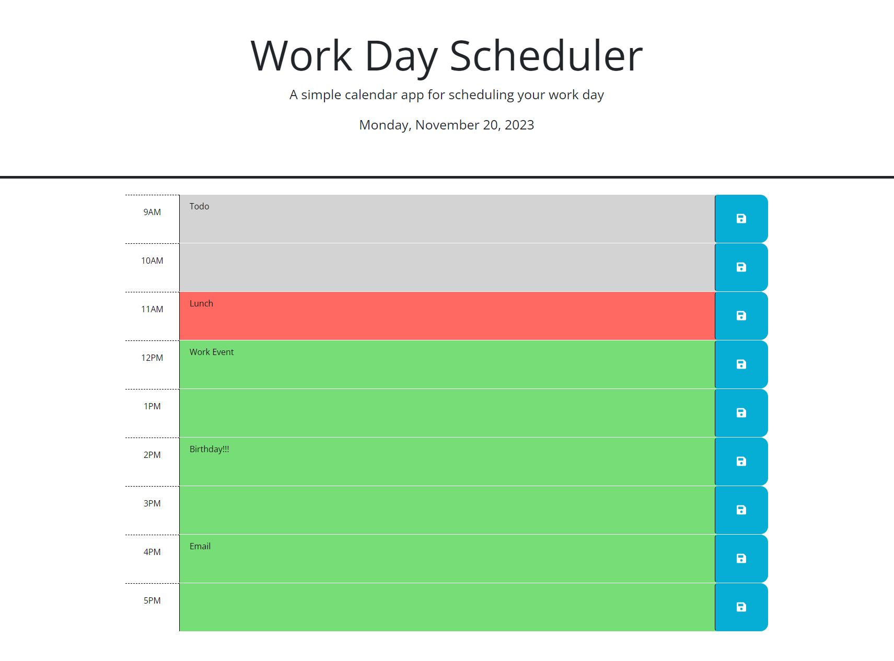

# Work Day Scheduler

## Description

The Work Day Scheduler is a web application that allows users to manage their daily schedule during standard business hours (9am-5pm). Users can add, edit, and save events for each hour, and the application dynamically updates the display to indicate whether each time block is in the past, present, or future.

Screenshot

## How to Use

1. Open the deployed app in your web browser.
2. View the time blocks for the current day.
3. Each block is color-coded to indicate whether the event takes place in the past, present, or future.
4. Click into a time block to enter an event.
5. Click teh save button for that time block to save the event in local storage.
6. Refreshing the page doesn't remove events.

## Features

- Dynamic updating of time blocks based upon the current time.
- Color-coded for information at a glance.
- Local storage saves user input.

## Deployment

The application is deployed and accessible online. It is available [here] [https://agerian.github.io/challenge-scheduler/].

The GitHub repo for the project is available [here] [https://github.com/Agerian/challenge-scheduler].